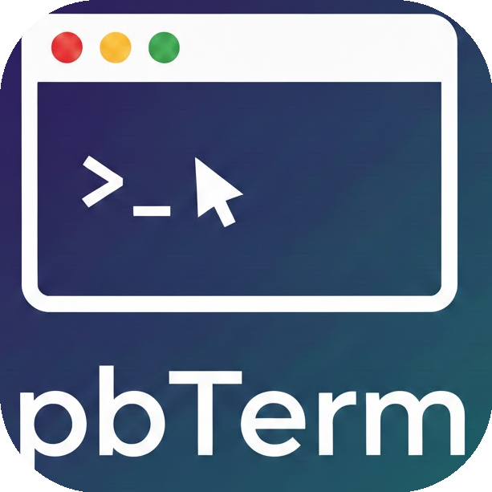
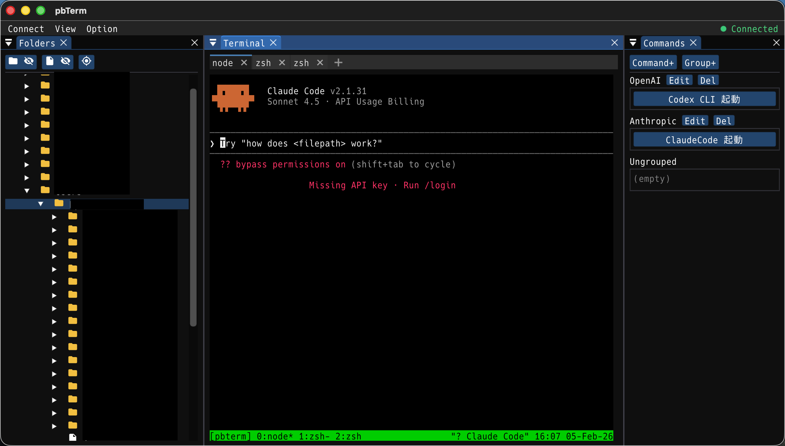

<p align="center">
  
</p>

<h1 align="center">pbTerm</h1>

<p align="center">
  <strong>A lightweight, high-performance SSH terminal client for macOS built with Dear ImGui</strong>
</p>

<p align="center">
  
  
  
  
</p>

<p align="center">
  
</p>

---

## Overview

pbTerm is a modern SSH terminal client that leverages the power of Dear ImGui's immediate mode GUI paradigm to deliver a smooth, responsive user experience. Designed specifically for macOS, it combines the flexibility of a fully-featured terminal emulator with convenient productivity tools like command shortcuts and remote file browsing.

### Key Highlights

- **Fast & Lightweight** - Built with C++17 and OpenGL for optimal performance
- **Full Terminal Emulation** - VT100/VT220 compatible via libvterm
- **tmux Integration** - Automatic session management for persistent connections
- **Bilingual Interface** - Full support for English and Japanese UI
- **CJK Support** - Proper rendering of Chinese, Japanese, and Korean characters

## Features

### SSH Connection Management

| Feature | Description |
|---------|-------------|
| **Authentication** | Support for both public key and password authentication |
| **Connection Profiles** | Save and manage multiple SSH connection profiles |
| **Auto-Connect** | Option to automatically connect on application startup |
| **Secure Storage** | Profiles stored locally in `~/.config/pbterm/` |

### Terminal Emulator

The terminal emulator is powered by **libvterm**, providing full VT100/VT220 compatibility:

- **Complete Terminal Emulation** - Supports escape sequences, colors (256 colors), bold, italic, underline, and other text attributes
- **CJK Character Support** - Proper width calculation for full-width characters (Japanese, Chinese, Korean)
- **Scrollback Buffer** - Up to 10,000 lines of scrollback history
- **Mouse Selection** - Click and drag to select text, automatic copy to clipboard
- **Resize Support** - Dynamic terminal resizing with proper reflow

### tmux Integration

pbTerm seamlessly integrates with tmux for enhanced session management:

- **Auto Session Creation** - Automatically creates or attaches to a tmux session on connect
- **Tab-based Window Management** - Each tmux window appears as a tab in the UI
- **Session Persistence** - Your work persists even if the connection drops
- **Window Polling** - Automatic refresh of tmux window list

### Command Shortcuts (CommandDock)

Boost your productivity with customizable command shortcuts:

- **One-Click Execution** - Run frequently used commands instantly
- **Group Organization** - Organize commands into logical groups
- **Drag & Drop Reordering** - Easily rearrange commands and groups
- **Persistent Storage** - Commands saved to JSON for persistence across sessions
- **Context Menu** - Right-click for quick edit, delete, and move operations

### Remote Folder Tree (FolderTreeDock)

Browse and navigate remote file systems with ease:

- **Tree View** - Hierarchical display of remote directories
- **Cross-Platform** - Automatic detection and support for Unix and Windows remote systems
- **Quick Navigation** - Click on a folder to `cd` into it in the terminal
- **File Operations** - Create new folders and delete files/directories
- **Lazy Loading** - Directories are loaded on-demand for performance

### Settings & Customization

| Setting | Options |
|---------|---------|
| **Language** | English / Japanese (日本語) |
| **Font** | Select from available monospace fonts |
| **Font Size** | Adjustable font size (default: 18pt) |
| **Window State** | Remembers window size and position |
| **Layout** | ImGui docking layout saved automatically |

## Technology Stack

| Component | Technology |
|-----------|------------|
| **GUI Framework** | [Dear ImGui](https://github.com/ocornut/imgui) with Docking |
| **Window/Input** | [GLFW 3](https://www.glfw.org/) |
| **Rendering** | OpenGL 3.3+ |
| **SSH Protocol** | [libssh](https://www.libssh.org/) |
| **Terminal Emulation** | [libvterm](https://www.leonerd.org.uk/code/libvterm/) |
| **Build System** | CMake 3.20+ |
| **Language** | C++17 |
| **Target Platform** | macOS 12.0+ (Apple Silicon supported) |

## Architecture

pbTerm follows a modular architecture with clear separation of concerns:

```
┌─────────────────────────────────────────────────────────────┐
│                         App                                  │
│  (Main application lifecycle, ImGui setup, docking layout)  │
└─────────────────────────────────────────────────────────────┘
        │              │              │              │
        ▼              ▼              ▼              ▼
┌─────────────┐ ┌─────────────┐ ┌─────────────┐ ┌─────────────┐
│TerminalDock│ │ CommandDock │ │FolderTreeDock│ │SettingsDialog│
│  (Tab UI)   │ │ (Shortcuts) │ │ (File Tree) │ │  (Config)   │
└─────────────┘ └─────────────┘ └─────────────┘ └─────────────┘
        │                              │
        ▼                              │
┌─────────────┐                        │
│  Terminal   │◄───────────────────────┘
│ (libvterm)  │
└─────────────┘
        │
        ▼
┌─────────────────────────────────────────────────────────────┐
│                     SshConnection                            │
│            (SSH session, multiple channels)                  │
└─────────────────────────────────────────────────────────────┘
        │
        ▼
┌─────────────┐
│TmuxController│
│(Session mgmt)│
└─────────────┘
```

### Threading Model

- **Main Thread** - GLFW event loop, ImGui rendering, OpenGL drawing
- **Reader Threads** - One per SSH channel for non-blocking data reception
- **Thread Safety** - Mutex protection for shared resources (terminal buffer, SSH session)

## Building from Source

### Prerequisites

Install the required dependencies using Homebrew:

```bash
brew install glfw libssh libvterm
```

### Clone and Build

```bash
# Clone with submodules (Dear ImGui)
git clone --recursive https://github.com/hiroshi-tamura/pbTerm-imgui.git
cd pbTerm-imgui

# Create build directory
mkdir build && cd build

# Configure and build
cmake ..
cmake --build . --config Release -j$(sysctl -n hw.ncpu)
```

### Running

```bash
# Open as macOS app bundle
open pbTerm.app

# Or run directly
./pbTerm.app/Contents/MacOS/pbTerm
```

## Configuration

All configuration files are stored in `~/.config/pbterm/`:

| File | Description |
|------|-------------|
| `settings.json` | Application settings (language, font, window size) |
| `profiles.json` | SSH connection profiles (host, port, username, auth method) |
| `commands.json` | Command shortcuts and groups |
| `imgui.ini` | ImGui window layout and docking configuration |

### Example Profile Structure

Profiles support the following fields:
- Host address
- Port (default: 22)
- Username
- Authentication method (public key / password)
- Private key path
- Auto-connect flag

## Project Structure

```
pbTerm-imgui/
├── CMakeLists.txt           # Build configuration
├── Info.plist.in            # macOS app bundle info
├── README.md
│
├── include/                 # Header files
│   ├── App.h                # Main application class
│   ├── Terminal.h           # Terminal emulator (libvterm wrapper)
│   ├── SshConnection.h      # SSH connection & channel management
│   ├── TerminalDock.h       # Terminal UI with tab support
│   ├── TmuxController.h     # tmux session controller
│   ├── CommandDock.h        # Command shortcuts UI
│   ├── FolderTreeDock.h     # Remote folder tree UI
│   ├── SettingsDialog.h     # Settings dialog & localization
│   ├── ProfileManager.h     # SSH profile persistence
│   └── ConnectionDialog.h   # Connection configuration dialog
│
├── src/                     # Source files
│   ├── main.cpp             # Entry point
│   ├── App.cpp              # Application implementation
│   ├── Terminal.cpp         # Terminal emulator implementation
│   ├── SshConnection.cpp    # SSH implementation
│   ├── TerminalDock.cpp     # Terminal dock implementation
│   ├── TmuxController.cpp   # tmux controller implementation
│   ├── CommandDock.cpp      # Command dock implementation
│   ├── FolderTreeDock.cpp   # Folder tree implementation
│   ├── SettingsDialog.cpp   # Settings implementation
│   ├── ProfileManager.cpp   # Profile manager implementation
│   └── ConnectionDialog.cpp # Connection dialog implementation
│
├── external/
│   └── imgui/               # Dear ImGui (git submodule)
│
└── resources/
    ├── fonts/               # Bundled fonts
    │   ├── HackGen*.ttf     # HackGen font family (Japanese support)
    │   └── MaterialIcons-Regular.ttf  # Material Design icons
    └── icon/
        └── pbTerm.icns      # Application icon
```

## Keyboard Shortcuts

| Shortcut | Action |
|----------|--------|
| `Cmd + ,` | Open Settings |
| `Cmd + N` | New Connection |
| `Cmd + W` | Close Tab |
| `Cmd + C` | Copy (when text selected) |
| `Cmd + V` | Paste |

## Known Limitations

- macOS only (no Windows/Linux support currently)
- Requires tmux installed on remote host for full functionality
- Single SSH connection at a time (multiple channels supported)

## License

MIT License

## Author

hiroshi-tamura

## Acknowledgments

- [Dear ImGui](https://github.com/ocornut/imgui) - Immediate mode GUI library
- [libssh](https://www.libssh.org/) - SSH protocol implementation
- [libvterm](https://www.leonerd.org.uk/code/libvterm/) - Terminal emulator library
- [GLFW](https://www.glfw.org/) - Window and input handling
- [HackGen](https://github.com/yuru7/HackGen) - Programming font with Japanese support
